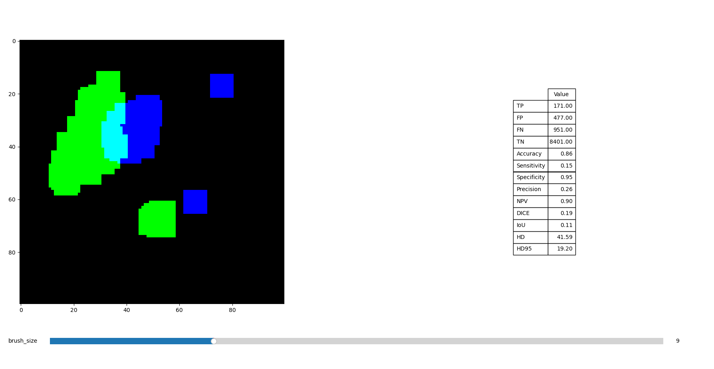

# Metric Playground
This tool allows to tryout how metrics react to different annotation and prediction pairs.



## Installation 
You can either setup a Python enviroment yourself (Tested 3.9) or use conda/pip to install based on the provided files. 

### Installation (Conda)

1. Download _metric_teaching.py_, _metric_functions.py_ and _environment.yml_ or clone the repository
1. Install Anaconda or Miniconda from: https://docs.conda.io/en/latest/miniconda.html
1. Open a terminal/command prompt.
1. Navigate to the directory where the Python file and _environment.yml_ are located.
1. Create the conda environment using the provided _environment.yml_ file:
	```terminal
	conda env create -f environment.yml
	```
1. Activate the environment:
	conda activate metric_teaching
1. Run the Python script:
	python metric_teaching.py
	
	
### Installation (Pip)

1. Download _metric_teaching.py_, _metric_functions.py_ and _requirements.txt_ or clone the repository
1. Install Python from the official website: https://www.python.org/downloads/  (Tested with version 3.9)
1. Install pip (if not included with the Python installation).
1. Open a terminal/command prompt.
1. Navigate to the directory where the Python file and _requirements.txt_ are located.
1. Run the following command to create a virtual environment:
	```terminal
	python -m venv env
	```
1. Activate the virtual environment:
	- On Windows: `.\env\Scripts\activate`
	- On macOS/Linux: `source env/bin/activate`
1. Install the required packages:
	```terminal
	pip install -r requirements.txt
	```
1. Run the Python script:
	```terminal
	python metric_teaching.py
	```


### Self  Installation

The required packages are:
- numpy
- matplotlib
- scipy
- scikit-learn


## Usage
You can draw the reference annotation with _left click_ and the model output with _right click_. Press _ESC_ to clear all annotations. 
With the slider, you can adapt the brush size. 

## Extension
If you want to add your own metrics add them to the "metricDict" in _metric_functions.py_
